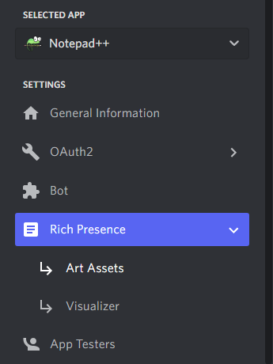
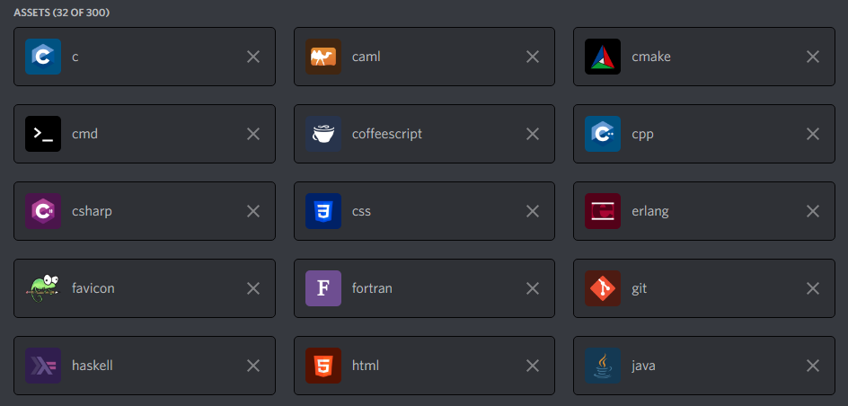

## Create Custom Rich Presence

To create a custom rich presence you must create an [application for discord](https://discord.com/developers/applications), if you already have an application created you only need the ID and enter it in the text field in the "Custom Application id" options window... Now we need to upload the images in the application, going to the [Rich Presence > Art Assets] section

Discord recommends for images a resolution of 1024x1024 (recommended) and a minimum of 512x512. The plugin has a limit of accepting programming languages so you cannot upload images of programming languages or script files that are not included

Support
* java
* typescript
* javascript
* c
* cpp
* csharp
* css
* haskell
* html
* php
* python
* ruby
* xml
* visualbasic
* cmd (Batch)
* lua
* cmake
* perl
* json
* yaml
* objectivec
* rust
* lisp
* r
* swift
* fortran
* erlang
* coffeescript
* git
* markdown

The "favicon" image cannot be missing in your application, you must include it. [Open favicon](https://github.com/Zukaritasu/notepadpp_rpc/blob/main/favicon.png)

Example after uploading the images

If you already do all the steps you can open Notepad++ and check in discord
