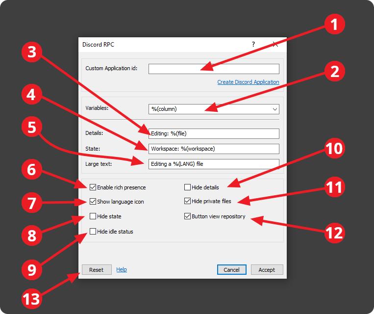
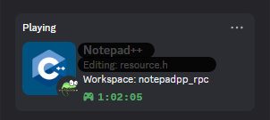
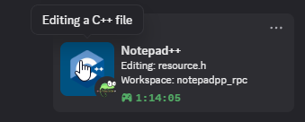

# Settings Documentation

## How to find the options menu
To open the plugin settings window, go to the options bar at the top of Notepad++ and select the “Plugins” drop-down menu, where you will find the installed plugins and other options for managing them. Among them, you will find the “Discord Rich Presence” plugin. Clicking on it will open another drop-down menu with the plugin options. The important option is “Options,” which will open a plugin configuration window.

<p align="center">
  
</p>

## Window Settings

<p align="center">
  
</p>

1) By default, a Client ID is used to display the rich presence on Discord, but if you want to further customize the presence, you can create an application on the official [Discord Developers Application](https://discord.com/developers/applications) website and paste the Client ID into the text box. For more information, see the following link [Custom Rich Presence](https://github.com/Zukaritasu/notepadpp_rpc/blob/main/DOCUMENTATION.md)

> [!IMPORTANT]  
> If you don't know how to create a Discord application, don't do it, as doing it wrong can cause the plugin to stop working.

2) Drop-down menu of variables available for rich presence. For added convenience, you can copy the variable from the drop-down menu text box

3) In this field, you can write whatever you like using the available variables. The resulting format cannot exceed 127 characters.

<p align="center">
  
</p>

4) In this field, you can write whatever you like using the available variables. The resulting format cannot exceed 127 characters.

<p align="center">
  
</p>

5) In this field, you can write whatever you like using the available variables. The resulting format cannot exceed 127 characters.

<p align="center">
  
</p>

6) Enable or disable rich presence
7) Hides or shows the icon of the currently active language in Notepad++. If the language icon is hidden, the default icon will be used. If the language is not recognized by Notepad++ or is not included in the plugin, the default icon will be used
8) Hide or show status
9) Hide or enable idle status. By default, the minimum time elapsed to display idle status is five minutes, but this time can be edited in the add-on configuration file, as it cannot be edited directly in the configuration window. To make the idle status disappear, simply move the text cursor in the editor or type directly into it

<p align="center">
  
</p>

10) Hide or show status
11) Hides or shows private files in a Git repository. The plugin uses the gitignore file as a reference to identify private files and folders in the repository
12) Enables or disables the button that redirects the user to the client's remote repository. The plugin obtains the URL of the remote repository from the private .git folder, but if this does not exist, the button will not be enabled
13) Resets the plugin settings to their default values

# Configuration file

The file format is YAML (Yet Another Markup Language). Example: 

```yaml
hideDetails: false
elapsedTime: false
enable: true
langImage: true
hideState: false
clientId: 938157386068279366
detailsFormat: "Editing: %(file)"
stateFormat: "Workspace: %(workspace)"
largeTextFormat: Editing a %(LANG) file
refreshTime: 1000
buttonRepository: true
hideIfPrivate: true
hideIdleStatus: false
idleTime: 300
```

Some properties of the file can be edited in the file itself, but Notepad++ must be restarted for the changes to take effect. These are the parameters that can be edited directly in the file, but not in the plugin settings window:


| Parameter | Description |
| --- | --- |
| refreshTime | This parameter is used to define how often presence is updated. By default, the value is 1000 milliseconds, which means that presence is updated every second |
| idleTime | This parameter defines the minimum time to display the inactive status in online presence. The default value is 300 seconds (5 minutes) |

> [!CAUTION]
> Editing the configuration file to enter abnormal values may cause the plugin or Notepad++ to stop working, so you must be very careful.
