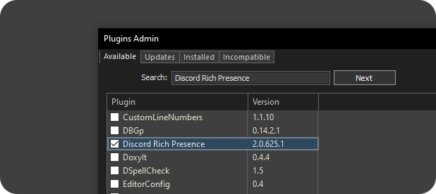

# Discord Rich Presence for Notepad++


<p align="center">
  
  
  
</p>

This plugin shows Discord the file you are currently editing in [Notepad++](https://github.com/notepad-plus-plus/notepad-plus-plus). If you change to another file or open a file the plugin will automatically show the new file you are editing. When you close [Notepad++](https://github.com/notepad-plus-plus/notepad-plus-plus) or disable rich presence the plugin will stop showing in discord what you are editing until you enable the plugin

The plugin has an options window in which you can edit the way the plugin should display the file you are editing, you also have the possibility to create your own application to use your custom images in the rich presence. For more information: [Create Custom Rich Presence](https://github.com/Zukaritasu/notepadpp_rpc/blob/main/DOCUMENTATION.md)

## Installation

To install the plugin manually you must download the plugin from [Releases](https://github.com/Zukaritasu/notepadpp_rpc/releases), then you must create a folder with the name "**DiscordRPC**" in the following path:
 * **C:\Program Files\Notepad++\plugins** or
 * **C:\Program Files (x86)\Notepad++\plugins**

After creating the folder you must unzip the downloaded file and paste it into the following path:
 * **C:\Program Files\Notepad++\plugins\DiscordRPC**

And now it's time! Open Notepad++ and verify that the rich presence is showing up in Discord. Remember that the plugin requires internet connection and to have Discord open, although you can continue editing your files without any problem in case you don't have internet connection or Discord is closed

<p align="center">
  
</p>

*The plugin can currently be found in [The official collection of Notepad++ plugins](https://github.com/notepad-plus-plus/nppPluginList) so by simply opening the plugin manager from Notepad++ you can install it by entering "Discord Rich Presence" in the search box*

<p align="center">
  
</p>

*The plugin has a default application ID, so it is not necessary to create an application for the plugin to work, only in case you want to create a custom application with your images*

## Contributing

There are two ways to contribute to this repository, the first is by helping in the editing of images, for this you should go to [Contribute with image editing](https://github.com/Zukaritasu/notepadpp_rpc/blob/main/images/CONTRIBUTING.md). The second way to contribute is by solving problems in the source code or adding new features to the plugin

To solve problems in the source code and among other things it is not necessary to follow the same syntax as the rest of the source code, you only have to comment the code and be tidy. After you have created a fork and made changes in the source code you only have to make pull request and explain what you have done... remember to test the plugin to make sure it works correctly

## Support
If you have any problems with the plugin or have any questions about its functionality, you can join my Discord server [ZukaDev - Server Support](https://discord.gg/sKeKgJSz3S) and go to the **#support** channel and leave your question with the following information:

```
- What version of Windows do you have?
- 32-bit, 64-bit or ARM64 architecture?
- The version of Notepad++ you have
- The DiscordRPC plugin version
```

## Important
To ensure proper functionality of the plugin and its dependencies, it is recommended to have the Microsoft Visual C++ Redistributable for Visual Studio 2015–2022 installed. This unified package covers runtime components for Visual Studio 2015 (VC++ 14.0) through Visual Studio 2022 (VC++ 14.3) and ensures compatibility with builds targeting C++14, C++17, and later.

If legacy support is required (e.g. for builds compiled with Visual Studio 2013 / VC++ 12.0), you should also install the Visual C++ 2013 Redistributable separately.

You can find the latest supported redistributable packages on Microsoft’s official VC++ Redistributable page [Microsoft’s official VC++ Redistributable page](https://learn.microsoft.com/en-us/cpp/windows/latest-supported-vc-redist?view=msvc-170)


## Documentation

* [Create Custom Rich Presence](https://github.com/Zukaritasu/notepadpp_rpc/blob/main/DOCUMENTATION.md)
* [Plugin Configuration Documentation](https://github.com/Zukaritasu/notepadpp_rpc/blob/main/DOCUMENTATION_SETTINGS.md)

## Discord Information

* [RPC](https://discord.com:2053/developers/docs/topics/rpc)
* [Example Set Activity Payload](https://discord.com:2053/developers/docs/topics/rpc#setactivity-example-set-activity-payload)

## Libraries used

* [yaml-cpp](https://github.com/jbeder/yaml-cpp)
* [nlohmann/json](https://github.com/nlohmann/json)
