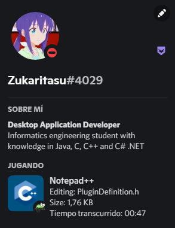

# Discord Rich Presence for Notepad++

  

Shows in Discord the file that is currently being edited in [Notepad++](https://github.com/notepad-plus-plus/notepad-plus-plus). Every time you open, close, save changes, or switch from one file to another, the presence is updated. In case the Notepad++ window is closed, the plugin is uninstalled or disabled from the options, the presence will disappear 

## Installation

To add the plugin to Notepad++, you need to download the zipped file based on your system architecture and in the following path 
 * **C:\Program Files\Notepad++\plugins** or
 * **C:\Program Files (x86)\Notepad++\plugins**

You need to create a folder named DiscordRPC 
 * **C:\Program Files\Notepad++\plugins\DiscordRPC**

And paste the content into that folder. If you had Notepad++ open then you should close it and open it again and check if it shows in your profile



*The plugin is available on [The official collection of Notepad++ plugins](https://github.com/notepad-plus-plus/nppPluginList). You can install it from the plugin manager by entering "Discord Rich Presence" in "search".*

## Support
If you have any problems with the plugin or have any questions about its functionality, you can join my discord server https://discord.gg/xEtAtmU6 and go to the **#npp-support** channel and leave your question with the following information:

```
* What version of Windows do you have?
* 32 or 64 bits architecture?
* The version of Notepad++ you have
* The DiscordRPC plugin version
```

## Documentation

* [Create Custom Rich Presence](https://github.com/Zukaritasu/notepadpp_rpc/blob/main/DOCUMENTATION.md)

## Discord SDK Information

* [SDK Starter Guide](https://discord.com/developers/docs/game-sdk/sdk-starter-guide)
* [Activities](https://discord.com/developers/docs/game-sdk/activities)
* [How To](https://discord.com/developers/docs/rich-presence/how-to)
